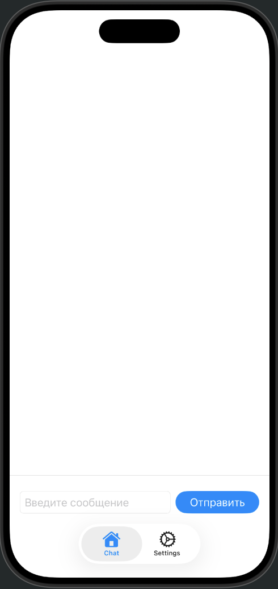
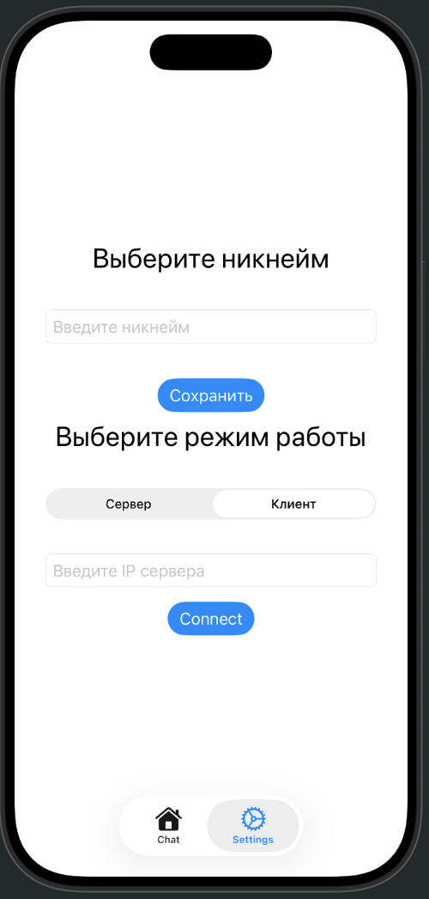

# NearChat

---

## 📱 Описание

**NearChat** — это современный локальный мессенджер на SwiftUI для общения пользователей внутри одной локальной сети.  
Интерфейс интуитивно понятен и выполнен в нативном стиле Apple.

---

## 📝 To Do

- [ ] Изменение и сохранение никнейма
- [ ] Выбор режима работы (Сервер/Клиент)
- [ ] Отображение и определение локального IP-адреса устройства
- [ ] Возможность подключения к серверу по локальному IP
- [ ] Реализация чата и обмена сообщениями в локальной сети
- [ ] Отображение статуса подключения и ошибок
- [ ] UI/UX улучшения
- [ ] Автоматический поиск серверов в сети

---

## 🎬 Скриншоты

> 
> 

---
